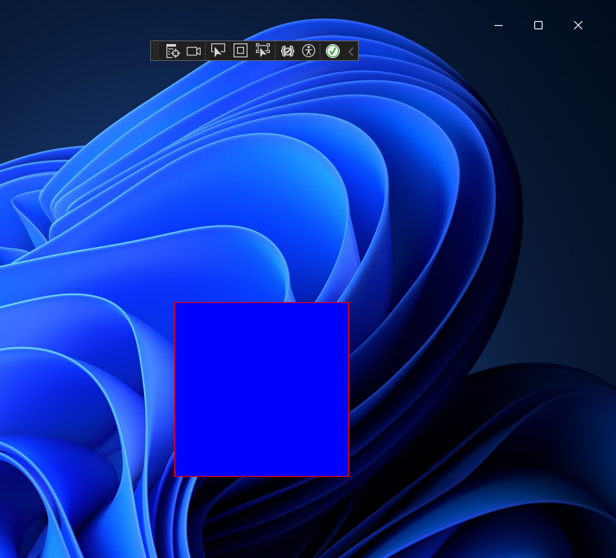

# Sample project to demonstate a transparent swapchain with simple draw utilties

**result screen as below**

**thanks to [vortice](https://github.com/amerkoleci/Vortice.Windows), [castrorix/WinUI3_SwapChainPanel_Layered](https://github.com/castorix/WinUI3_SwapChainPanel_Layered) and [WinUIEx](https://github.com/dotMorten/WinUIEx)**
